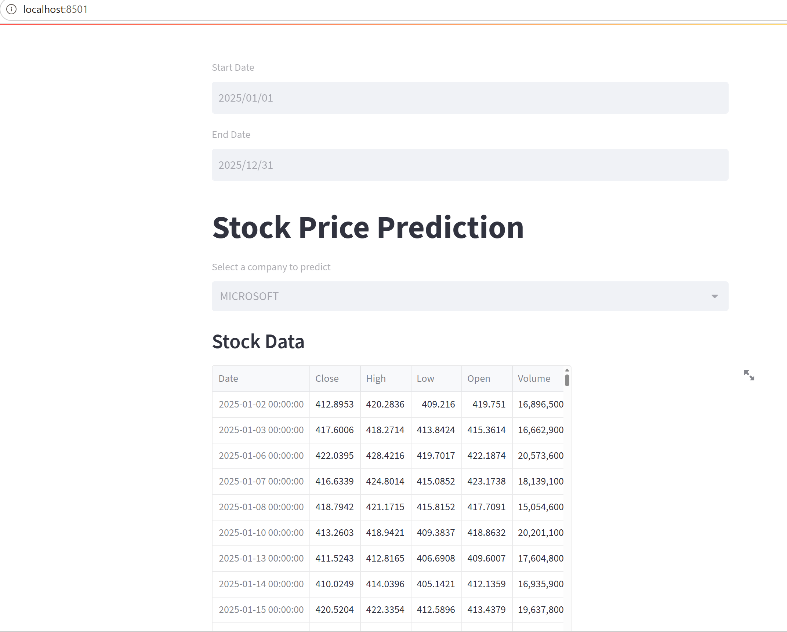
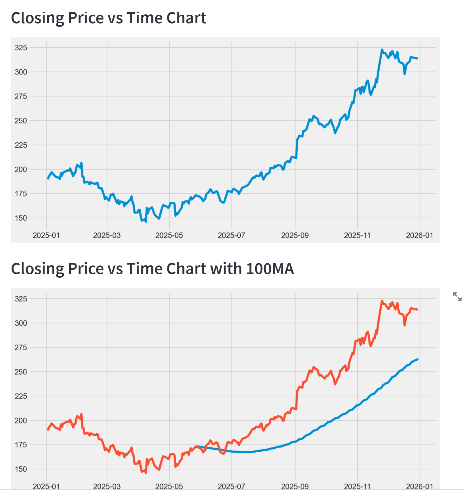
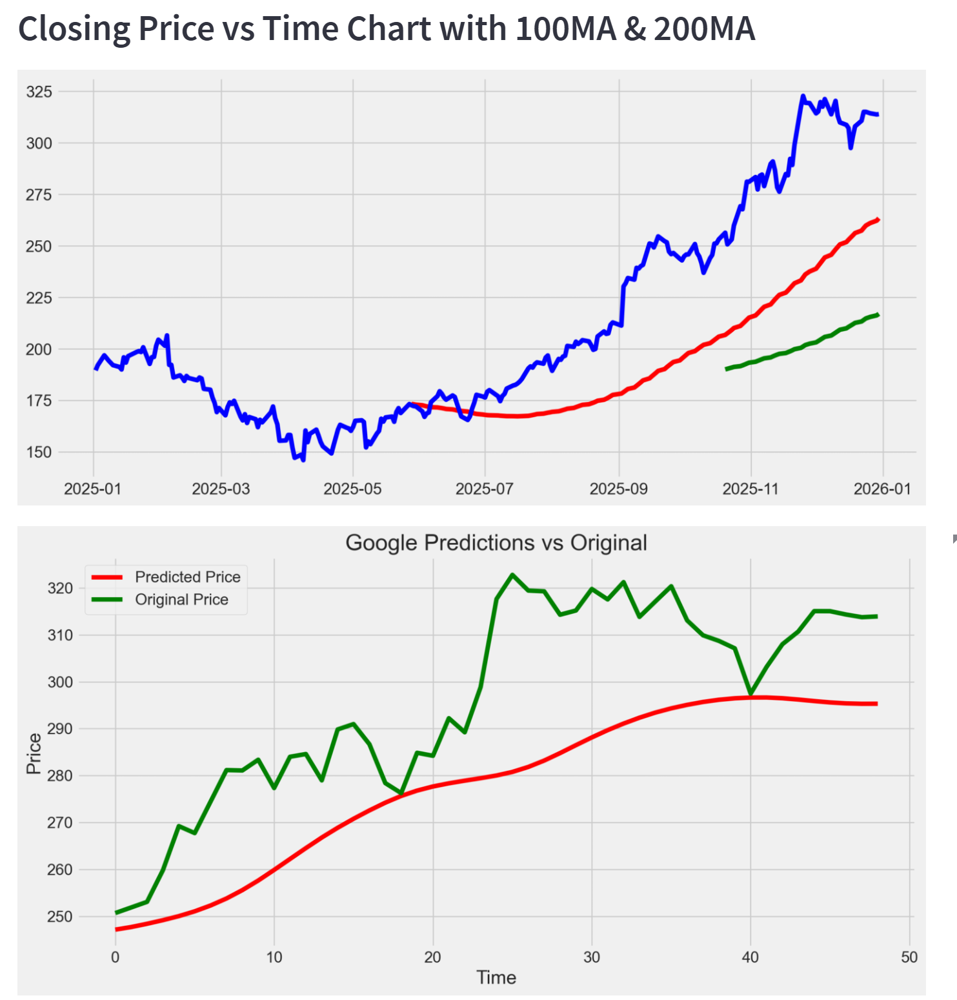

# Stock Price Prediction App

This app is use for fetching and displaying stock price prediction from a finance website (yfinance).

Install python
The app uses python.

Install libraries
This code: python -m pip install -r requirements.txt must be use to install all the  necessary libraries in the requirement folder. Note that the keras and tensorflow version must be same so it can be compatible for the app to work. 

How to start the app
Start the app by runnig this code: streamlit run stock_price.py on the terminal. It will lunch the app on your local machine and you will the able to navigate to different comapny's stock.

## App Preview

### Stock Data Page

### Closing Price Analysis

### Prediction 
